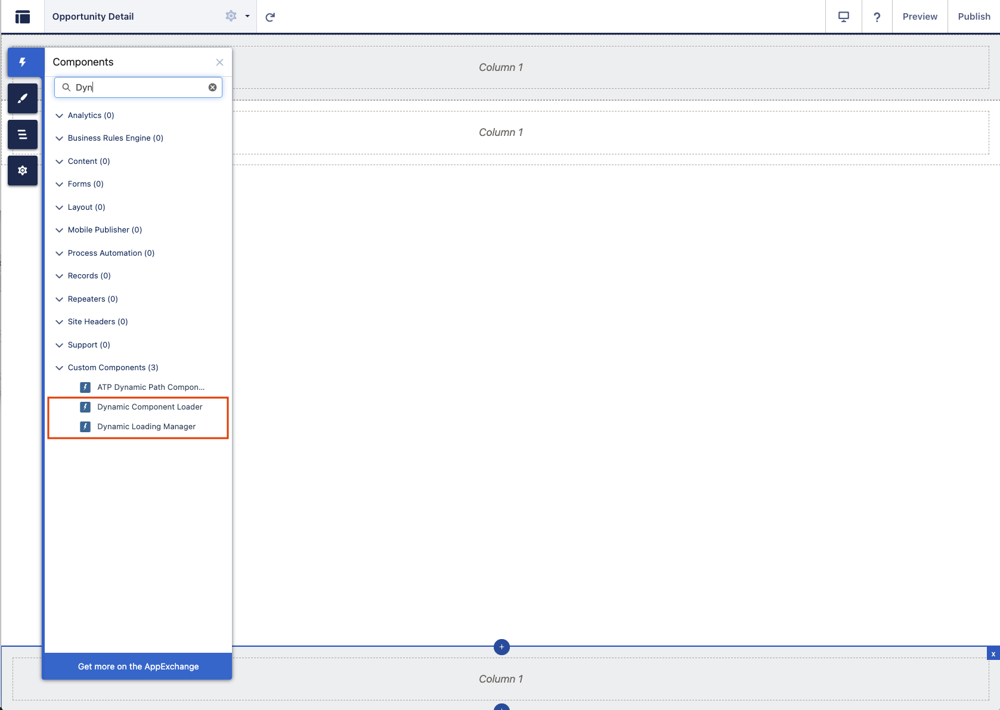
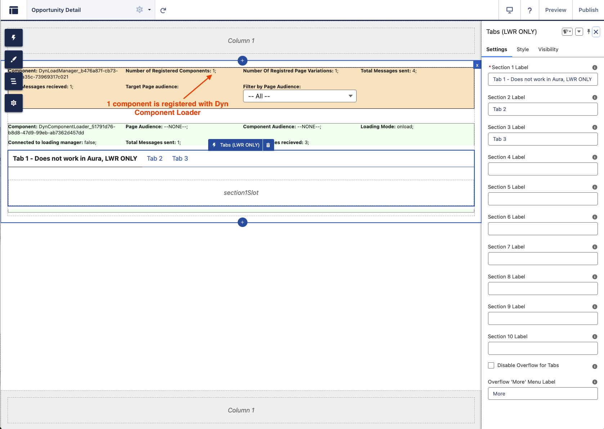

# Architectural Document: LWR Page Dynamic Loading and Variation Solution

## Table of Contents

* [1. Introduction](#1-introduction)
    * [Problem](#problem)
    * [Solution Overview](#solution-overview)
* [2. Solution Architecture](#2-solution-architecture)
    * [Key Components](#key-components)
    * [Interaction Flow](#interaction-flow)
* [3. Audience Rule Language Grammar](#3-audience-rule-language-grammar)
    * [Overview](#overview)
    * [Grammar (EBNF Style)](#grammar-ebnf-style)
    * [Key Elements Explained](#key-elements-explained)
    * [Examples](#examples)
* [4. Pros of the Solution](#4-pros-of-the-solution)
* [5. Potential Cons](#5-potential-cons)
* [6. Implementation Details](#6-implementation-details)
* [7. Configuration Guide (Experience Builder)](#7-configuration-guide-experience-builder)
* [8. Diagrams](#8-diagrams)
    * [Custom Metadata Structure Diagram](#custom-metadata-structure-diagram)
    * [Class Diagram (Simplified LWC & Core Logic)](#class-diagram-simplified-lwc--core-logic)
    * [Sequence Diagram: Initial Page Load (onload component)](#sequence-diagram-initial-page-load-onload-component)
    * [Sequence Diagram: Initial Page Load (onvisible component)](#sequence-diagram-initial-page-load-onvisible-component)
    * [Sequence Diagram: Context Change (Simplified -e.g. Record Update triggering refresh/re-eval)](#sequence-diagram-context-change-simplified--eg-record-update-triggering-refreshre-eval)

## 1. Introduction

### Problem

Salesforce Lightning Web Runtime (LWR) sites lack the built-in page variation functionality available in Aura sites. While LWR offers component variations, adapting existing Aura LWC components solely for this purpose can involve significant refactoring efforts. This necessitates a custom solution to achieve dynamic page and component visibility based on audience criteria within LWR sites.

### Solution Overview

This document outlines an architectural solution that implements page-level and component-level variations for Salesforce LWR sites. It leverages a proprietary conditional language evaluated by a central JavaScript interpreter to determine the visibility of specific components based on defined audience rules.

The core principle is:
* If no audience rule is defined for a page or component, it is always visible.
* If audience rules *are* defined, the component is only displayed if the relevant rule(s) evaluate to true based on the current user and record context.

This approach effectively ports the concept of Aura page variations to LWR by using a combination of custom LWC components, Lightning Message Service (LMS), and Apex controllers.

## 2. Solution Architecture

The solution comprises several key components working together to manage dynamic component visibility.

### Key Components

* **`dynLoadManager` (LWC):**
    * **Role:** Acts as the central orchestrator on an LWR page. Each page requiring dynamic content will host one instance.
    * **Responsibilities:**
        * Fetches audience context (user info, record data) and audience rules via Apex (`AudienceContextController`) upon initialization. The context fetching depends on the page type (Named Page, Object Page, Record Page).
        * Contains the JavaScript interpreter (`ConditionInterpreter`) to evaluate the proprietary conditional language defined in audience rules.
        * Maintains a registry of `dynComponentLoader` instances present on the page.
        * Determines the target page audience based on prioritized rules fetched from `LWR_Audience_Page_Level_Rule_Priority__mdt`.
        * Evaluates both page-level and component-level audience rules to decide component visibility.
        * Communicates visibility decisions (`showNow = true/false`) to relevant `dynComponentLoader` components via LMS messages.
        * Provides debugging and visibility control features within the Experience Builder.
    * **Visibility:** Visible in Experience Builder for configuration but not rendered on the live site.

* **`dynComponentLoader` (LWC):**
    * **Role:** Acts as a wrapper or container for the actual business LWC that needs conditional visibility. Multiple instances can exist on a page.
    * **Responsibilities:**
        * Registers itself with the `dynLoadManager` upon initialization or when requested via LMS, sending its `componentId`, `pageAudience`, `compAudience`, `loadingMode`, and `loadingOrder`.
        * Holds the actual business component within its default slot (`<slot>`).
        * Listens for LMS messages (specifically `DYN_CMP_CMD_SHOW`) from the `dynLoadManager`.
        * Conditionally renders the wrapped component based on the `showNow` flag received from the `dynLoadManager`.
        * Supports different `loadingMode` options (e.g., `onload`, `onvisible`). For `onvisible`, it uses `IntersectionObserver` to notify the `dynLoadManager` when it scrolls into view.
        * Sends messages back to the manager if its `pageAudience` property changes.
    * **Visibility:** Visible in Experience Builder for configuration, but the wrapper itself is not intended to be visually rendered on the live site (only the conditionally rendered child component is).

* **`lmsPubSubHelper` (LWC):**
    * **Role:** A reusable utility component facilitating communication over a universal LMS channel (`UniversalTopicBasedChannel__c`).
    * **Responsibilities:**
        * Subscribes to the specified LMS channel upon connection.
        * Dispatches received messages to its parent LWC via a custom event (`messagereceived`).
        * Provides a public API method (`sendMessage`) for parent components (`dynLoadManager`, `dynComponentLoader`) to publish messages onto the LMS channel.
        * Handles subscription cleanup upon disconnection.

* **`dynLoaderMessageHelper` (JavaScript Module):**
    * **Role:** Defines the structure and constants for messages exchanged via LMS between the manager and loader components.
    * **Responsibilities:**
        * Exports `TOPICS` constants representing different message types (e.g., `DYN_CMP_REGISTER`, `DYN_CMP_CMD_SHOW`, `DYN_CMP_VISIBLE`).
        * Exports a `MESSAGE_FACTORY` object containing factory functions to create standardized message payloads for each topic, ensuring consistent communication.

* **`AudienceContextController` (Apex):**
    * **Role:** Server-side controller responsible for fetching the necessary data for audience evaluation.
    * **Responsibilities:**
        * Provides `@AuraEnabled` methods (`getContextAndRulesByRecordId`, `getContextAndRulesByObjectApiName`, `getContextAndRulesByPageName`) callable from `dynLoadManager`.
        * Retrieves user context (Profile, Role, Custom Permissions via `getUserCustomPermissions`, Location).
        * Retrieves relevant SObject data based on the current record context and fields specified in `LWR_Audience_Resource__mdt` custom metadata. Uses `SObjectNullValueSubstituter` to handle potential null values in queried data.
        * Fetches audience rule definitions (`LWR_Audience_Rule__mdt`) and page-level priorities (`LWR_Audience_Page_Level_Rule_Priority__mdt`) using the `AudienceMetadataProvider`.
        * Bundles context, rules, and priorities into the `AudienceRulesAndContext` wrapper class for returning to the LWC.

* **`AudienceMetadata` (Apex):**
    * **Role:** Provides an abstraction layer for accessing audience-related Custom Metadata Types (CMDTs).
    * **Responsibilities:**
        * Defines the `AudienceMetadataProvider` interface, specifying methods to get rules, priorities, and resource field definitions.
        * Includes `RealAudienceMetadataProvider`, a concrete implementation that queries the `LWR_Audience_Rule__mdt`, `LWR_Audience_Page_Level_Rule_Priority__mdt`, and `LWR_Audience_Resource__mdt` CMDTs.

* **`SObjectNullValueSubstituter` (Apex):**
    * **Role:** A utility class to prevent errors caused by null values in SObject fields queried for audience evaluation.
    * **Responsibilities:**
        * Replaces null values in specified SObject fields (including related object fields) with type-appropriate default values (e.g., empty string, 0, false) or defined default field values.

* **Proprietary Conditional Language & Interpreter (`audience_rules_interpreter.js`):**
    * **Role:** Defines the syntax for audience rules and evaluates them.
    * **Syntax:** Supports comparisons (`==`, `!=`, `~=` (endsWith), `=~` (startsWith)), logical operators (`&&`, `||`), parentheses for grouping, and referencing context variables (e.g., `User.ProfileId`, `Opportunity.RecordType.DeveloperName`, `Permission == 'SomePermission'`). It also supports evaluating nested `Audience` rules.
    * **Interpreter:** The `ConditionInterpreter` class parses the rule string (tokenization, validation), converts it to Reverse Polish Notation (RPN) using the Shunting Yard algorithm, and evaluates the RPN stack against the context provided by `dynLoadManager`. The context includes Profile, Role, Permissions, Location, Domain, Data (SObject data), and the map of Audience rules.

### Interaction Flow

1.  **Page Load:** `dynLoadManager` initializes.
2.  **Context Fetching:** `dynLoadManager` calls the appropriate method in `AudienceContextController` (Apex) based on the page type (recordId, objectApiName, or pageName) to get user/record context, all audience rules, and prioritized page-level rules for the current page context.
3.  **Interpreter Initialization:** `dynLoadManager` initializes the `ConditionInterpreter` with the fetched context and rules.
4.  **Target Audience Determination:** `dynLoadManager` evaluates the prioritized page-level rules to determine the single `targetAudience` for the current page view.
5.  **Loader Registration:** Each `dynComponentLoader` instance initializes and sends a `DYN_CMP_REGISTER` message via `lmsPubSubHelper` containing its details (componentId, pageAudience, compAudience, loadingMode).
6.  **Manager Receives Registration:** `dynLoadManager` receives the registration messages via its `lmsPubSubHelper` and stores component details.
7.  **Visibility Evaluation (onload):** For components with `loadingMode = 'onload'`, the `dynLoadManager` immediately checks:
    * If the component's `pageAudience` matches the determined `targetAudience` (or is null/empty).
    * If the component's `compAudience` rule evaluates to true using the `ConditionInterpreter` (or is null/empty).
8.  **Show Command (onload):** If both checks pass, `dynLoadManager` sends a `DYN_CMP_CMD_SHOW` message (via LMS) with `showNow: true` targeted at the specific `componentId`.
9.  **Loader Receives Command:** The target `dynComponentLoader` receives the message and sets its internal `showNow` property to true, causing the wrapped component in its slot to render.
10. **Visibility Evaluation (onvisible):** For components with `loadingMode = 'onvisible'`, the `dynComponentLoader` uses an `IntersectionObserver`. When the component becomes visible in the viewport, it sends a `DYN_CMP_VISIBLE` message.
11. **Manager Receives Visible:** `dynLoadManager` receives the `DYN_CMP_VISIBLE` message.
12. **Visibility Evaluation & Show (onvisible):** The manager performs the same audience checks as in step 7. If they pass, it sends the `DYN_CMP_CMD_SHOW` message. The loader then renders the component and disconnects the observer.
13. **Experience Builder Interaction:** `dynLoadManager` provides controls to view components associated with specific page audiences within the builder, sending `DYN_CMP_BUILDER_CHG_VISIBILITY` messages.

## 3. Audience Rule Language Grammar

This section defines the syntax of the proprietary conditional language used in the `Audience_Rule__c` field of the `LWR_Audience_Rule__mdt` metadata type and evaluated by the `ConditionInterpreter`.

### Overview

The language allows expressing conditions based on user context, record data, and permissions. It supports logical combinations of comparisons.

### Grammar (EBNF Style)

```ebnf
rule         ::= expression

expression   ::= term { ('&&' | '||') term }

term         ::= factor | '(' expression ')'

factor       ::= comparison

comparison   ::= variable comparator literal
               | 'Audience' '==' literal        (* Special case for nesting rules *)

variable     ::= identifier { '.' identifier }  (* e.g., User, User.Profile.Name, Opportunity.RecordType.DeveloperName *)
               | 'Permission'                   (* Special context variable for Custom Permissions (Set<String>) *)
               | 'Profile'                      (* Special context variable for User Profile Name (String) *)
               | 'Role'                         (* Special context variable for User Role Name (String) *)
               | 'Location'                     (* Special context variable for User Location (Set<String>) *)
               | 'Domain'                       (* Special context variable for User Domain (String) *)
               | 'Audience'                     (* Special variable for rule nesting *)

identifier   ::= (alpha | '_') { alpha | digit | '_' } (* Standard identifier rules *)

comparator   ::= '==' | '!=' | '=~' | '~='       (* equals, not equals, startsWith, endsWith *)

literal      ::= string_literal | boolean_literal (* Number literals not explicitly handled in provided interpreter snippet *)

string_literal ::= "'" (character | escape_sequence)* "'" (* e.g., 'PARTNER_SALES_USER', 'true', 'GC' *)

boolean_literal ::= 'true' | 'false' (* Note: Often represented as strings like 'true'/'false' in examples, handled by interpreter *)

escape_sequence ::= '\\\'' (* Only escape sequence explicitly handled in provided tokenizer *)

alpha        ::= 'a'..'z' | 'A'..'Z'
digit        ::= '0'..'9'
```

### Key Elements Explained

* **`rule` / `expression`:** The basic structure is a logical expression combining terms with `&&` (AND) or `||` (OR). Parentheses `()` can be used for grouping and controlling precedence.
* **`term` / `factor`:** Represents the conditions being evaluated, primarily comparisons.
* **`comparison`:** The core unit of evaluation. It typically involves comparing a `variable` to a `literal` using a `comparator`.
    * **Special Case `Audience`:** When the variable is `Audience`, the `==` operator triggers a recursive evaluation of the named audience rule specified by the `literal`.
    * **Set Variables (`Permission`, `Location`, etc.):** When the `variable` is a Set of strings (like `Permission` or `Location`):
        * `==`: Checks if the `literal` string exists as an element *within* the Set.
        * `!=`: Checks if the `literal` string *does not exist* as an element within the Set.
        * `=~` (startsWith): Checks if *at least one element* within the Set starts with the `literal` string.
        * `~=` (endsWith): Checks if *at least one element* within the Set ends with the `literal` string.
* **`variable`:** Represents data points from the context.
    * Starts with a top-level context object like `User`, `Account`, `Opportunity`, `Campaign`, `Lead`, etc., or a special variable like `Permission`, `Profile`, `Role`, `Location`, `Domain`, `Audience`.
    * Uses dot notation (`.`) to access fields on the context objects or their related records (e.g., `User.CurrentPersona__c`, `Opportunity.RecordType.DeveloperName`). The specific objects and fields available depend on the page context and the fields defined in the `LWR_Audience_Resource__mdt` metadata.
* **`comparator`:** Defines the type of comparison:
    * `==`: Equal to (handles standard comparison and Set membership check).
    * `!=`: Not equal to (handles standard comparison and Set non-membership check).
    * `=~`: Starts with (for strings, or checks if any element in a Set starts with).
    * `~=`: Ends with (for strings, or checks if any element in a Set ends with).
    * *Note:* While common, operators like `>`, `<`, `>=`, `<=` for numerical or date comparisons are *not* explicitly supported by the provided `audience_rules_interpreter.js` code snippet.
* **`literal`:** Represents fixed values. Primarily string literals enclosed in single quotes (e.g., `'Active'`) or boolean values (which may be represented as strings `'true'`/`'false'` in rules and converted during evaluation).

### Examples

* `User.CurrentPersona__c == 'PARTNER_SALES_USER'` (Variable `User.CurrentPersona__c`, Comparator `==`, Literal `'PARTNER_SALES_USER'`)
* `Permission == 'ChatterEnabled'` (Special Variable `Permission` (Set), Comparator `==` (membership check), Literal `'ChatterEnabled'`)
* `Permission != 'ChatterEnabled'` (Special Variable `Permission` (Set), Comparator `!=` (non-membership check), Literal `'ChatterEnabled'`)
* `Audience == 'Core_Perm_Sets'` (Special Variable `Audience`, Comparator `==`, Literal `'Core_Perm_Sets'`)
* `Campaign.RecordType.DeveloperName =~ 'ChildCampaign'` (Variable `Campaign.RecordType.DeveloperName`, Comparator `=~` (startsWith), Literal `'ChildCampaign'`)
* `( Opportunity.AccountSub_Type__c == 'ENT' || Opportunity.AccountSub_Type__c == 'GOV' ) && User.Region__c == 'GC'` (Uses parentheses, `||`, and `&&`)

## 4. Pros of the Solution

* **Reusability:** Leverages standard LWC, LMS, and Apex, promoting reusable components and patterns. `lmsPubSubHelper` is a generic utility.
* **Flexibility:** The conditional language and use of Custom Metadata for rules provide significant flexibility in defining complex audience criteria without code changes.
* **Decoupling:** LMS effectively decouples the `dynLoadManager` from the `dynComponentLoader` instances.
* **Centralized Logic:** The core evaluation logic resides within the `dynLoadManager` and the `ConditionInterpreter`, making it easier to manage and update.
* **Lazy Loading:** The `onvisible` loading mode provides performance benefits by deferring the rendering (and potential data fetching within the wrapped component) until the component is actually needed.
* **Experience Builder Integration:** Components are visible and configurable within the Experience Builder, providing a configuration interface for admins/developers.

## 5. Potential Cons

* **Complexity:** Introduces several custom components and a proprietary language, adding complexity compared to a native platform feature. Maintenance requires understanding the interaction flow and the rule language.
* **Performance:**
    * Rule evaluation occurs client-side in JavaScript. Very complex rules or a large number of components could potentially impact page performance, although caching of evaluated rules in `dynLoadManager` mitigates this somewhat.
    * Initial context fetching from Apex adds a server round trip. Caching (`@AuraEnabled(cacheable=true)`) helps.
* **Proprietary Language:** Users need to learn and manage the specific syntax and capabilities of the custom conditional language. Errors in rule syntax might be harder to debug than standard formula fields or code.
* **LMS Limits:** High-frequency updates or a very large number of components on a single page could potentially approach LMS message limits, although this is unlikely in typical scenarios.
* **Scalability:** Managing a large number of audience rules and priorities through Custom Metadata could become cumbersome without proper organization and tooling.

## 6. Implementation Details

* **Audience Association:**
    * Rules are defined in `LWR_Audience_Rule__mdt` with an `Audience_Id__c` and the `Audience_Rule__c` (the condition string).
    * Page-level priorities are set in `LWR_Audience_Page_Level_Rule_Priority__mdt`, linking an `Audience_Rule_Id__c` to a target (`SObject__c` representing an object API name or a page name) and assigning a numeric `Audience_Rule_Priority__c`. Lower numbers have higher priority.
    * Fields needed for evaluation are defined in `LWR_Audience_Resource__mdt`, mapping an `Sobject_API_Name__c` to a JSON array of `Fields_Array__c`.
    * `dynComponentLoader` instances have `@api` properties `pageAudience` and `compAudience` (corresponding to `Audience_Id__c` values) configured in the Experience Builder.

* **LMS Message Structure (`dynLoaderMessageHelper.js`):**
    * Uses a `topic` field to categorize messages (e.g., `DYN_CMP_REGISTER`, `DYN_CMP_CMD_SHOW`).
    * Includes a `payload` object containing relevant data:
        * `DYN_CMP_REGISTER`: `{ cmpId, pageAudience, compAudience, loadMode, loadingOrder }`
        * `DYN_CMP_CMD_SHOW`: `{ targetCmp: string | string[], showNow: boolean }`
        * `DYN_CMP_VISIBLE`: `{ cmpId, pageAudience, compAudience, loadMode, loadingOrder }`
        * `DYN_CMP_IS_AVAILABLE`: `{ targetCmp: string | string[] }` (Manager announces readiness)
        * `DYN_CMP_BUILDER_CHG_VISIBILITY`: `{ targetCmp: string | string[], showNow: boolean }` (For Builder UI)
        * `DYN_CMP_PAGE_AUDIENCE_CHANGED`: `{ cmpId, pageAudience }`

* **Interpreter Logic (`audience_rules_interpreter.js`):**
    * `tokenize`: Breaks the rule string into tokens (literals, variables, operators, parentheses). Handles string literals and basic escape sequences.
    * `validateTokens`: Performs basic syntax checks (e.g., parenthesis matching, operator placement).
    * `categorizeToken`: Identifies if a token is a literal, a context variable (like `Profile`, `Role`, `Permission`, `Location`, `Domain`), an SObject field access (`Data.<SObjectName>.<FieldName>`), or an `Audience` reference. Validates against the provided context.
    * `shuntingYard`: Converts infix notation tokens to RPN (postfix) using Dijkstra's Shunting Yard algorithm, respecting operator precedence (`==`, `!=`, `=~`, `~=` > `&&` > `||`).
    * `evaluateRPN`: Evaluates the RPN expression using a stack.
    * `resolveValue`: Retrieves the actual value for variables from the `context` map provided by `dynLoadManager`.
    * `compareValues`: Handles the actual comparison logic for `==`, `!=`, `=~`, `~=`. It specifically handles comparisons against `Set` values (like Permissions, Location) and nested `Audience` evaluations (recursively calls `evaluate` for `Audience == 'SomeOtherAudience'`).
    * `evaluateOperation`: Performs the logical (`&&`, `||`) or comparison operations based on the operator token.

* **`dynComponentLoader` Processing:**
    * `connectedCallback`: (Implicitly initializes registration process via `renderedCallback`).
    * `renderedCallback`: Ensures registration message (`DYN_CMP_REGISTER`) is sent via LMS. Sets up `IntersectionObserver` if `loadingMode` is `onvisible`.
    * `handleMessage`: The core message handler. Filters messages based on `topic` and whether the `targetCmp` in the payload matches its own `componentId` or is `"*"`. Updates its `showNow` state based on `DYN_CMP_CMD_SHOW`. Handles builder visibility toggles via `DYN_CMP_BUILDER_CHG_VISIBILITY`. Responds to `DYN_CMP_IS_AVAILABLE` by re-registering.
    * `onObserve`: Callback for `IntersectionObserver`. Sends `DYN_CMP_VISIBLE` message when the component enters the viewport.
    * `disconnectedCallback`: Attempts to clean up the observer, though a comment notes potential issues with this firing reliably in the Experience Builder.

* **Design Patterns:**
    * **Publish/Subscribe:** Clearly implemented using Salesforce LMS for communication between `dynLoadManager` and `dynComponentLoader` instances.
    * **Factory:** `dynLoaderMessageHelper` acts as a Message Factory, providing functions to create consistently structured messages.
    * **Interpreter:** The `ConditionInterpreter` class implements the Interpreter pattern to process the proprietary conditional language.
    * **Strategy/Provider:** `AudienceMetadata` uses an interface (`AudienceMetadataProvider`) and a concrete implementation (`RealAudienceMetadataProvider`) to abstract the source of metadata (Strategy or Provider pattern).
    * **Facade (potentially):** `AudienceContextController` could be seen as a Facade, simplifying the process of gathering diverse context information (user, record, metadata) for the LWC.

## 7. Configuration Guide (Experience Builder)

This section outlines the steps to configure the dynamic visibility solution, starting with the necessary metadata setup and followed by the Experience Builder configuration.

**Metadata Setup Steps (Pre-Configuration):**

Before configuring components in the Experience Builder, the underlying audience rules and supporting metadata must be defined in Salesforce Setup:

1.  **Define Audiences and Personas:**
    * Analyze the requirements and identify the different user personas or conditions that will determine component visibility.
    * Decide which sets of components should be visible together on a page variation (Page Audiences) and which individual components have additional visibility rules (Component Audiences).

2.  **Create Audience Rules:**
    * For each identified Page Audience and Component Audience, create a corresponding record in the `LWR_Audience_Rule__mdt` Custom Metadata Type.
    * Define a unique `Audience_Id__c` (e.g., `Partner_Sales_Users`, `High_Value_Opportunities_View`). This ID will be used later in the Experience Builder configuration.
    * Write the conditional expression in the `Audience_Rule__c` field using the proprietary language syntax. Examples:
        * `User.Profile.Name == 'Partner Community User'`
        * `Permission == 'Can_Edit_Orders'`
        * `Opportunity.Amount > 100000 && Opportunity.IsClosed == false`
        * `Audience == 'Region_NorthAmerica'` (for nesting rules)

3.  **Prioritize Page-Level Audiences:**
    * For each page context (identified by SObject API Name for object/record pages, or a unique Page Name for named pages) where page variations are needed, define the priority of applicable Page Audience rules.
    * Create records in the `LWR_Audience_Page_Level_Rule_Priority__mdt` Custom Metadata Type.
    * Set the `SObject__c` field to the relevant SObject API Name or Page Name.
    * Set the `Audience_Rule_Id__c` to the ID of a Page Audience rule defined in step 2.
    * Assign an `Audience_Rule_Priority__c` number (lower numbers have higher priority). The first rule in the priority order that evaluates to true for a user will determine the active Page Audience for that page view.

4.  **Define Required Data Resources:**
    * Analyze the fields used across all your Audience Rules (from step 2).
    * For each SObject type whose fields are referenced in the rules, create a record in the `LWR_Audience_Resource__mdt` Custom Metadata Type.
    * Set `Sobject_API_Name__c` to the relevant object (e.g., `User`, `Opportunity`, `Account`).
    * In the `Fields_Array__c`, provide a JSON string array containing all the field API names needed for evaluation *from that specific SObject*, including relationship fields (e.g., `["ProfileId", "Country", "UserRoleId"]` for User, `["Amount", "IsClosed", "RecordType.DeveloperName", "Account.Type"]` for Opportunity).
    * **Hint:** For Record Pages (where `recordId` is available), you need to define resources for the record's SObject type *in addition* to the 'User' object. For other page types (Object Pages, Named Pages), typically only resources for the 'User' SObject are needed unless rules specifically reference other global context data.

**Experience Builder Configuration Steps:**

Once the metadata setup is complete and all components (LWCs, Apex, LMS Channel) are deployed, you can configure the components on the LWR page:


*Figure 1: Dyn Load Manager and Dyn Component Loader components available in Experience Builder.*

1.  **Add `dynLoadManager` to the Page:**
    * Open the target LWR page in Experience Builder.
    * Drag the `dynLoadManager` component onto the page canvas.
    * **Note:** Only *one* `dynLoadManager` per page.


*Figure 2: DynLoadManager component and its properties in Experience Builder.*

2.  **Wrap Business Components with `dynComponentLoader`:**
    * Drag `dynComponentLoader` onto the page where the conditional component should appear.
    * Drag the actual Business Component *inside* the `dynComponentLoader`.


*Figure 3: Dyn Component Loader component (without internal business component) and its properties in Experience Builder.*


*Figure 4: Dyn Component Loader component containing an internal LWR Tabs business component, with its properties shown.*

3.  **Configure `dynComponentLoader` Properties:**
    * Select the `dynComponentLoader`.
    * Configure properties:
        * **`Title` / `Description` (Optional, Builder Only):** For identification.
        * **`Loading Mode`:** `onload` or `onvisible`.
        * **`Loading Order` (Optional):** Number for ordering components with the same load mode.
        * **`Page Audience`:** Enter the `Audience_Id__c` (from step 2 of Metadata Setup) defining the page variation this belongs to. Leave blank or use "--NONE--" if applicable to all page variations.
        * **`Component Audience`:** Enter the `Audience_Id__c` (from step 2 of Metadata Setup) defining specific conditions for this component. Leave blank or use "--NONE--" if always visible within its `Page Audience`.

4.  **Repeat for All Dynamic Components:** Repeat steps 2 and 3 for every component requiring conditional visibility.

5.  **Preview and Test:**
    * Use Experience Builder preview.
    * Log in as different users meeting various criteria.

By following these metadata and Experience Builder steps, you configure the dynamic behavior based on page and component audiences.

## 8. Diagrams

### Custom Metadata Structure Diagram

This diagram shows the Custom Metadata Types involved and their relationships.


**Key aspects of the Custom Metadata relationships (PK=Primary Key, FK=Foreign Key; no explicit referential integrity is used)**

1. `LWR_Audience_Rule__mdt`: This is the core definition of an audience rule. It contains a unique identifier (`Audience_Id__c`) used in the LWC configuration and the actual rule expression (`Audience_Rule__c`) that the ConditionInterpreter evaluates.
2. `LWR_Audience_Page_Level_Rule_Priority__mdt`: This Custom metadata determines which `LWR_Audience_Rule__mdt` should be considered the target audience for a specific page context (defined by SObject__c, which holds either an SObject API name or a page name). It links directly to an `LWR_Audience_Rule__mdt` via `Audience_Rule_Id__c` and sets its priority. Multiple rules can be defined for the same context, but the one with the lowest `Audience_Rule_Priority__c` that evaluates to true becomes the active page audience.
3. `LWR_Audience_Resource__mdt`: This Custom metadata informs the `AudienceContextController` which SObject fields are required for evaluating the rules associated with a given Sobject_API_Name__c (which could be 'User' or a record's object type). This ensures the necessary data is queried and made available in the context map for the `ConditionInterpreter`. The relationship to `LWR_Audience_Rule__mdt` is conceptual: the fields listed here are expected to be used within the `Audience_Rule__c` strings associated with that context.

### Class Diagram (Simplified LWC & Core Logic)


Note: Apex classes (`AudienceContextController`, `AudienceMetadata`, `SObjectNullValueSubstituter`) are shown conceptually in relation to `dynLoadManager`.

### Sequence Diagram: Initial Page Load (onload component)


### Sequence Diagram: Initial Page Load (onvisible component)


### Sequence Diagram: Context Change (Simplified -e.g. Record Update triggering refresh/re-eval)


